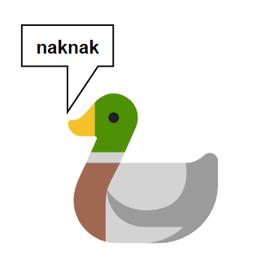

## [NakNak](https://asecuritysite.com/ctf/ctf_naknak) encoder and decoder in Go WASM
[NakNak](https://asecuritysite.com/ctf/ctf_naknak) encoder and decoder in Go WASM

## Getting Started

1. Install [Tinygo v0.30.0](https://github.com/tinygo-org/tinygo/releases/tag/v0.30.0) compiler for Golang.

2. For building console executable-
    
    1. Build console executable
    ```console
    <TINY_GO_PATH>/bin/tinygo build -o <PROGRAM> main_console.go
    ```

    2. Usage for console executable
    ```
    Usage: <PROGRAM> <SUBCOMMAND> <PARAMS...>
    SUBCOMMANDS:
      encode <TEXT>: encode the given text into naknak language
      decode <TEXT>: decode the naknak text
    ```

3. For building wasm file

    1. Install [binaryen](https://github.com/WebAssembly/binaryen/releases/tag/version_116)

    2. Build [wasm](./main.wasm) file
    ```console
        set WASMOPT="<BINARYEN_PATH>/bin/wasm_opt"
        <TINY_GO_PATH>/bin/tinygo build -o main.wasm -target wasm main_wasm.go
    ```

    3. The wasm file is used in the [index.html](./index.html) file
    
    4. The build wasm file is served on github pages [here](https://sinha-ujjawal.github.io/naknak/)

## Copyrights
Licensed under [@MIT](./LICENSE)
